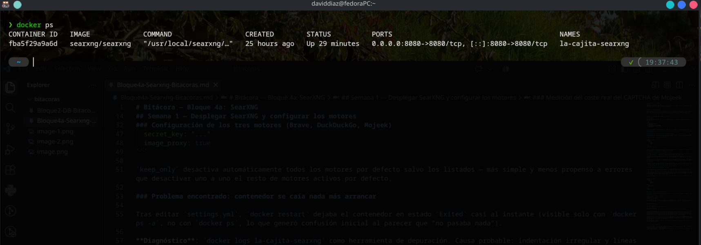
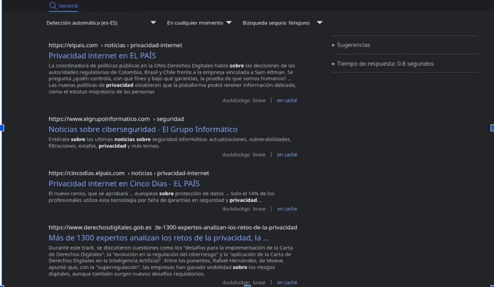
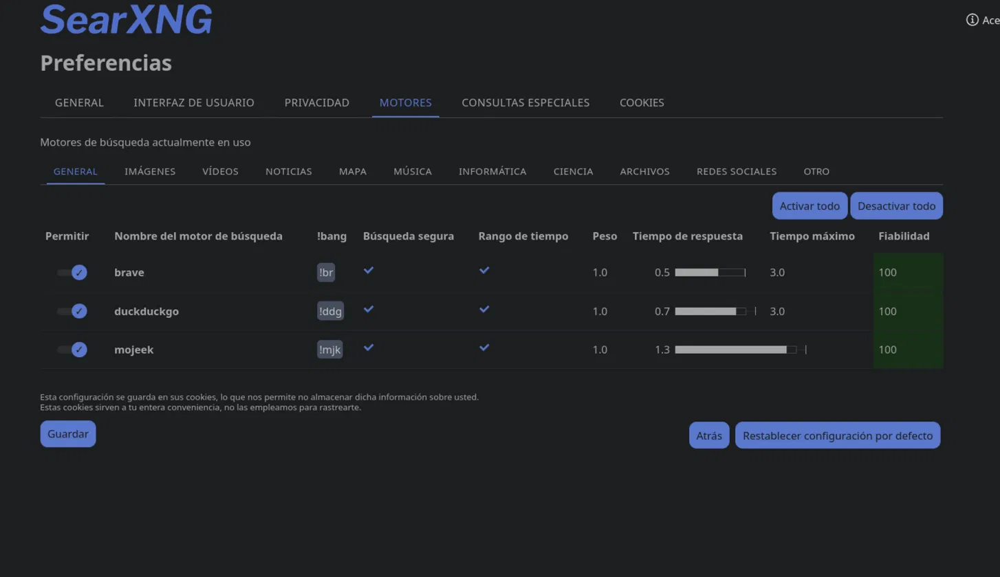

# Bitácora — Bloque 4a: SearXNG

**Periodo:** septiembre-octubre 2026
**Objetivo del bloque:** integrar SearXNG como proxy anonimizador de búsqueda, conectado a la BBDD local (SQLite+FTS5) según el flujo y el criterio de decisión ya diseñados en el Bloque 2.

---

## Semana 0 — Fundamentos de Docker

Repaso de conceptos básicos (imagen vs. contenedor, `docker run`, puertos, volúmenes) antes de tocar SearXNG, dado que era la primera vez trabajando con Docker. Instalación de Docker Engine en Fedora vía el repositorio oficial (`dnf config-manager` + `docker-ce`), y configuración del usuario en el grupo `docker` para no depender de `sudo` en cada comando.

---

## Semana 1 — Desplegar SearXNG y configurar los motores

### Despliegue

Contenedor levantado con `docker run` suelto (sin Compose todavía, para no generar trabajo desechable mientras Antonio cierra el Bloque 3):

```bash
docker run -d \
  --name la-cajita-searxng \
  -p 8080:8080 \
  -v ./searxng-config:/etc/searxng \
  -e BASE_URL=http://localhost:8080/ \
  searxng/searxng
```

- `-v` monta la carpeta de configuración como volumen, para que `settings.yml` (y cualquier ajuste) persista aunque se pare o recree el contenedor.
- `docker update --restart unless-stopped la-cajita-searxng` aplicado después, para que el contenedor se levante solo tras reiniciar el equipo.

### Configuración de los tres motores (Brave, DuckDuckGo, Mojeek)

`use_default_settings: true` carga toda la configuración interna de SearXNG (incluye los motores predefinidos) — el `settings.yml` propio solo necesita definir las excepciones sobre esa base, no repetir la configuración completa de cada motor.

Configuración final (`searxng-config/settings.yml`):

```yaml
use_default_settings:
  engines:
    keep_only:
      - brave
      - duckduckgo
      - mojeek

server:
  secret_key: "..."
  image_proxy: true
```

`keep_only` desactiva automáticamente todos los motores por defecto salvo los listados — más simple y menos propenso a errores que desactivar uno a uno el resto de motores activos por defecto.

### Problema encontrado: contenedor se caía nada más arrancar

Tras editar `settings.yml`, `docker restart` dejaba el contenedor en estado `Exited` casi al instante (visible solo con `docker ps -a`, no con `docker ps`, lo que generó confusión inicial al parecer que "no pasaba nada").

**Diagnóstico**: `docker logs la-cajita-searxng` como herramienta de depuración. Causa probable: indentación irregular y líneas en blanco dentro de la lista YAML de `keep_only`, que un parser YAML estricto no tolera bien pese a que visualmente parecía correcto.

**Solución**: reescribir el archivo con indentación limpia y consistente (2 espacios por nivel, sin tabuladores, sin líneas en blanco sueltas dentro de listas). Tras corregirlo, `docker start` mantuvo el contenedor corriendo de forma estable.

### Verificación

- Confirmado en `localhost:8080/preferences` (pestaña de motores) que Brave, DuckDuckGo y Mojeek aparecen listados.
- Búsqueda de prueba real desde la interfaz confirma respuesta de los motores.



### Mojeek no aparecía activo — diagnóstico y decisión

Tras la configuración inicial, Mojeek no aparecía en `localhost:8080/preferences` pese a estar en `keep_only`, sin ningún error de registro en los logs (a diferencia de `ahmia` y `torch`, que sí fallaban explícitamente al arrancar).

**Causa real**: en la configuración por defecto de esta versión de la imagen, Mojeek viene marcado como `inactive: true`, con el motivo documentado en el propio archivo: usa un CAPTCHA de tipo Proof of Work que consume capacidad de cómputo, por lo que los mantenedores de SearXNG lo desactivan por defecto. `keep_only` solo filtra qué motores existen en la configuración final — no toca el campo `inactive`, que es un mecanismo distinto.

**Solución para activarlo**: añadir un bloque `engines:` (a nivel superior, fuera de `use_default_settings`) que sobreescribe ese campo por nombre:

```yaml
use_default_settings:
  engines:
    keep_only:
      - brave
      - duckduckgo
      - mojeek

engines:
  - name: mojeek
    inactive: false

server:
  secret_key: "..."
  image_proxy: true
```

### Medición del coste real del CAPTCHA de Mojeek

Prueba con la misma consulta ("Noticias sobre privacidad informática"), comparando tiempo de respuesta con Mojeek desactivado vs. activado:

| Estado de Mojeek | Tiempo de respuesta |
|---|---|
| Desactivado | ~0.8 segundos |
| Activado | ~1.5 segundos |

Aproximadamente el doble de latencia (coherente con lo documentado sobre el coste del Proof of Work), pero en términos absolutos sigue estando en un rango perfectamente aceptable para un usuario real en el hardware de desarrollo (portátil).


Solo con brave y duckdukgo


Los tres al completo: brave, duckduckgo y mojeek


Comparativa del tiempo de respuesta entre los tres motores, proporcionado por el propio searxng


**Alternativas investigadas por si el coste resultara inasumible en hardware final**: motores con índice propio (no reescoltado de Google/Bing) son escasos — el abanico real se reduce a Brave (ya activo, no aporta diversidad nueva), Yep (índice propio grande respaldado por Ahrefs, pero un issue oficial de SearXNG documenta que su integración solo devuelve ~10 resultados por consulta) y Qwant (buena reputación de privacidad, soporte en SearXNG inconsistente entre versiones de imagen — mismo tipo de sorpresa que la de Mojeek). Ninguna es un sustituto claramente mejor sin contrapartidas propias.

**Decisión**: mantener Mojeek activo por defecto en esta fase (aporta el tercer índice independiente que justificó su elección original, y el coste absoluto de latencia es asumible). Reevaluar específicamente en el hardware final (Mini PC), donde la CPU disponible es mucho menor y además convivirá con el SLM corriendo en segundo plano — el cambio, si hiciera falta desactivarlo, es de una sola línea (`inactive: true`), sin rediseño.

SearXNG desplegado y funcional en local, con los tres motores configurados y verificados. Base lista para la Semana 2 (consumo de la API JSON desde Python).

Semana 2 — API de SearXNG desde Python
Exploración de la respuesta JSON

Endpoint de búsqueda con salida estructurada: GET /search?q=<término>&format=json. Estructura de la respuesta (simplificada):

json
{
  "query": "privacidad",
  "results": [
    {"title": "...", "content": "...", "url": "...", "engine": "brave"},
    ...
  ]
}

data es un diccionario, no una lista — query y results son dos claves independientes al mismo nivel (no una anidada dentro de la otra). data["results"] es la lista de resultados; cada resultado es a su vez un diccionario con title, content, url, engine.

Script de consulta (consultar_searxng.py)
python
import requests

query = input()

response = requests.get(
    "http://localhost:8080/search",
    params={"q": query, "format": "json"}
)
response.raise_for_status()

data = response.json()
results = data["results"]

for resultado in results:
    print(resultado["title"], resultado["content"], "----", resultado["url"], "engine:", resultado["engine"])

params={"q": query, "format": "json"} — q es el parámetro que espera SearXNG para el término de búsqueda; format: json le pide la respuesta como datos estructurados en vez de la página HTML normal de la interfaz.

Aviso a tener en cuenta

No todos los resultados garantizan tener todas las claves rellenas (por ejemplo, content puede venir vacío según el motor) — de momento no ha dado error porque la clave existe igualmente, pero si en el futuro aparece algún KeyError, sustituir el acceso directo (resultado["clave"]) por .get("clave", "") para mayor robustez.

Entregable de la semana

Script funcional que recibe un término por consola, consulta SearXNG y muestra los resultados parseados (título, contenido, url, motor de origen).


---

## Notas y aprendizajes generales

- El uso de `docker ps` (sin `-a`) para depurar un contenedor caído es un error fácil de cometer al empezar con Docker — sin el flag, un contenedor parado/crasheado es invisible en el listado, lo que puede hacer parecer que "no se creó nada" cuando en realidad sí existe, solo que no está corriendo.
- `docker logs <contenedor>` fue la herramienta clave para pasar de "no sé por qué falla" a un diagnóstico concreto — buen hábito a mantener para el resto del bloque.